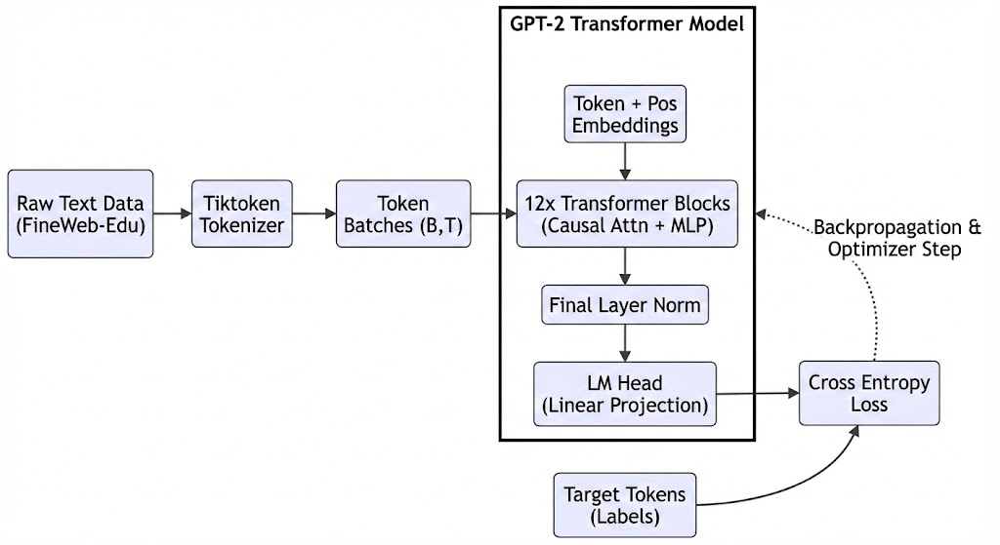
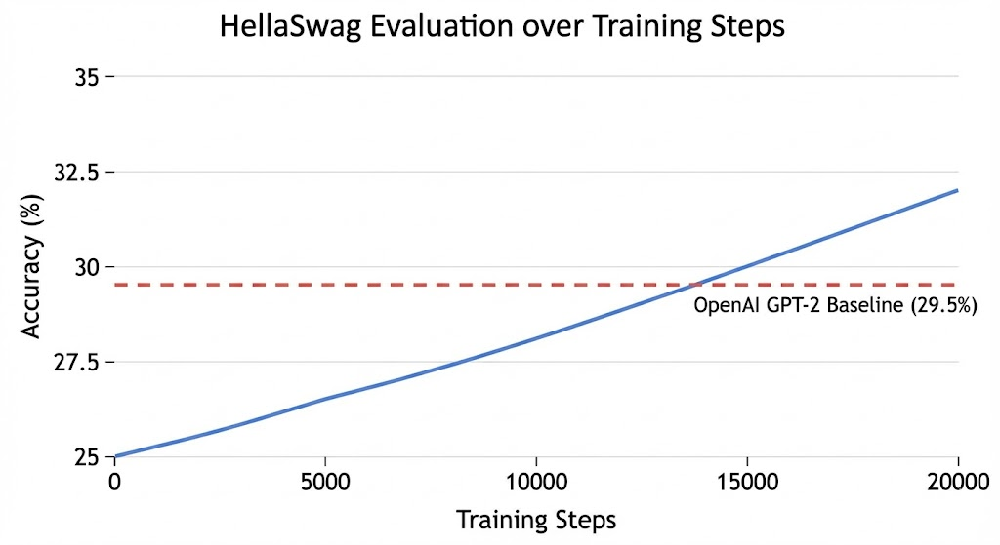
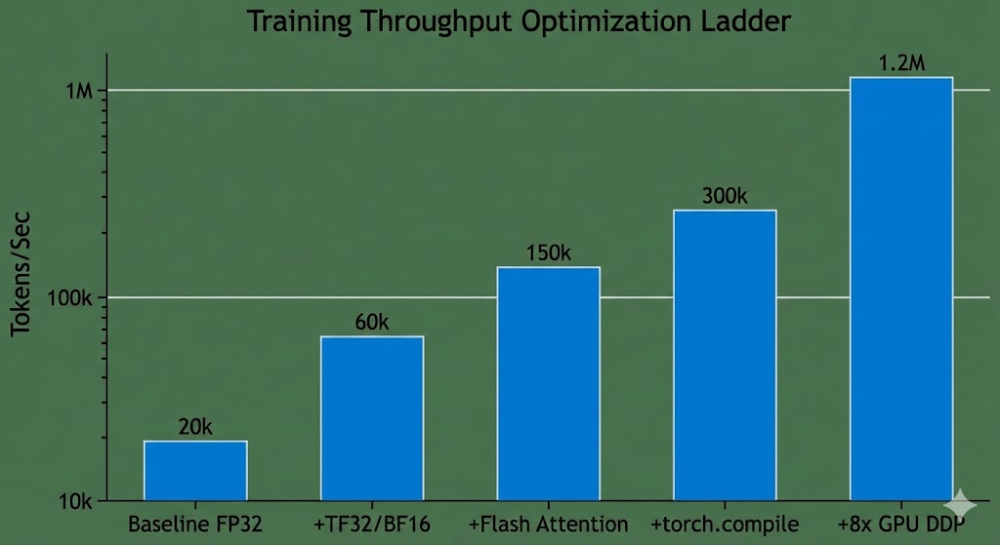

# Reproducing GPT-2 (124M)

## Overview

For this project, I decided to reproduce the 124 million parameter GPT-2 model from scratch. This language model is built in Python using PyTorch, heavily inspired by Andrej Karpathy's GPT2 guide. The model can be trained locally or on cloud GPUs and mirrors the architecture of OpenAI's original 2019 release.

## How it works

Here's the data flow of the language model:

## Model Architecture & Training

To train the model, I used the `FineWeb-Edu` (10 billion token sample) dataset, processing it with the standard GPT-2 byte-pair encoding (BPE) tokenizer.

I implemented a decoder-only Transformer architecture, matching the original GPT-2 hyperparameters (12 layers, 12 attention heads, 768 embedding dimensions). The token embeddings and language modeling head weights were tied to save memory and improve learning. To speed up training, I padded the vocabulary size from an awkward `50257` to a nearest power of two (`50304`), optimizing the operations for GPU tensor cores.

The HellaSwag evaluation metric allowed me to benchmark my training runs directly against OpenAI's original 124M model.

## Performance

In my program, I leveraged several modern PyTorch features to drastically speed up training and record throughput statistics. The optimizations included:

* **Mixed Precision:** Utilizing BFloat16 and TensorFloat-32 (TF32) to reduce memory bandwidth bottlenecks.
* **Flash Attention:** Implementing fused kernels for the self-attention mechanism to prevent materializing large memory-intensive matrices.
* **Compilation:** Using `torch.compile` to reduce Python overhead and execute kernel fusion.
* **Distributed Training:** Using Distributed Data Parallel (DDP) to train across multiple GPUs simultaneously.

## Experience

I chose to build this model from scratch in order to fully understand all the components of a modern Large Language Model. The only external libraries I used were PyTorch for the tensor operations/autograd and `tiktoken` for the tokenization. All other operations including the causal self-attention, Gelu activations, and distributed training orchestration were implemented step-by-step. With this approach, I prioritized an in-depth understanding which will allow me to easily expand on this architecture in the future.

Although my model successfully accomplished the goal of reaching OpenAI's original HellaSwag benchmarks, here are a few future enhancements I could make. First, I would like to improve the data loader to randomly permute documents across shards between epochs, breaking up spurious document correlations.

Currently, the model only performs next-token prediction (pre-training). I would like to experiment with fine-tuning the model into a conversational format using Supervised Fine-Tuning (SFT) so that it can act as a chat assistant rather than a standard document completer.

Below is a summary of the pros and cons of my GPT-2 reproduction.

### Pros

* Implements modern LLM speed optimizations (FlashAttention, Kernel Fusion, `torch.compile`)
* Concurrently processes batches across multiple GPUs using DDP
* Gracefully manages GPU memory using Gradient Accumulation to simulate massive batch sizes (e.g., 0.5M tokens)
* Weight tying between token embeddings and the LM head saves ~30% in parameters
* High throughput, achieving well over 100k tokens/second per GPU

### Cons

* 124M parameters is very small compared to modern multi-billion parameter architectures
* Because it is purely a base model, it simply babbles completions and cannot naturally follow instructions or chat
* Data loader iterates deterministically and does not shuffle data chunks across epochs
* PyTorch's `torch.compile` can occasionally introduce bugs when switching from training logic to text generation mode